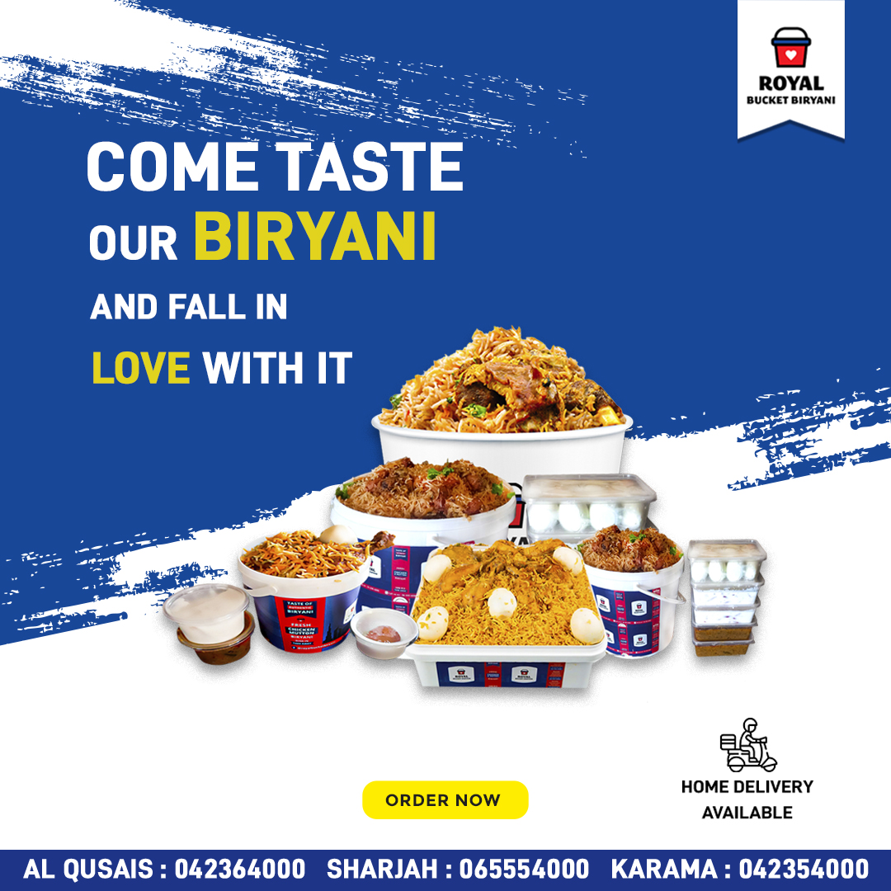

# Poster Design for Company (Freelancer)

This repository contains the source files and assets for the posters designed for a company as a freelance designer. The purpose of this project was to create visually appealing and effective posters that promote the company's products, services, events, or brand message.

## Introduction

As a freelance designer, I created these posters for a company to communicate their offerings, attract potential customers, and enhance brand awareness. These posters are visually striking, convey a clear message, and align with the company's branding guidelines.

## Getting Started

To get started with the poster design process, I followed these steps:

1. Reviewed the project requirements and gathered necessary information.

2. Installed the necessary design software (e.g., Adobe Photoshop, Adobe Illustrator, or other preferred tools) on my computer.

3. Familiarized myself with the company's branding guidelines, target audience, and specific requirements for each poster design.

4. Started working on the poster designs, ensuring to follow the design guidelines and incorporating the company's branding elements.

## Usage

If you would like to use or modify the poster designs, feel free to do so for personal or commercial purposes. However, attribution to the original creator (me) is appreciated.

## Clients
&nbsp; &nbsp;
&nbsp;&nbsp;

## Design Guidelines

As a freelance designer, I followed these design guidelines:

- Used the company's logo and branding elements consistently to maintain brand identity.

- Kept the designs clean, uncluttered, and easy to read.

- Utilized high-quality images and graphics that align with the company's image.

- Chose colors that complemented the company's branding and evoked the desired emotions.

- Included clear call-to-action (CTA) that prompted viewers to take the desired action.

- Ensured that the designs reflected the company's values, target audience, and the message they wanted to convey.

## Contributing

As this project showcases my work as a freelancer, contributions are not expected. However, if you have any feedback or suggestions, feel free to share them.

---

